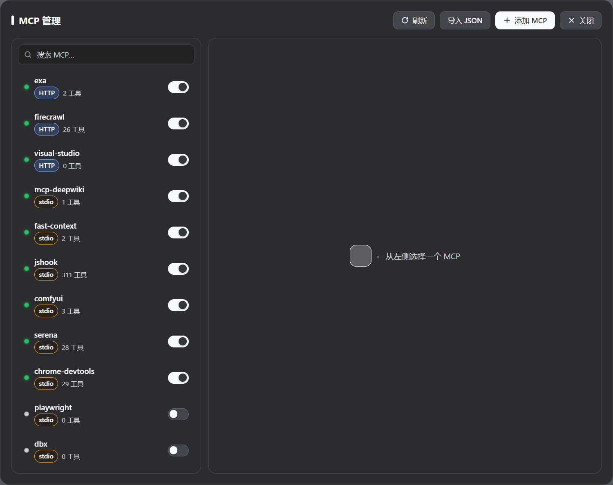
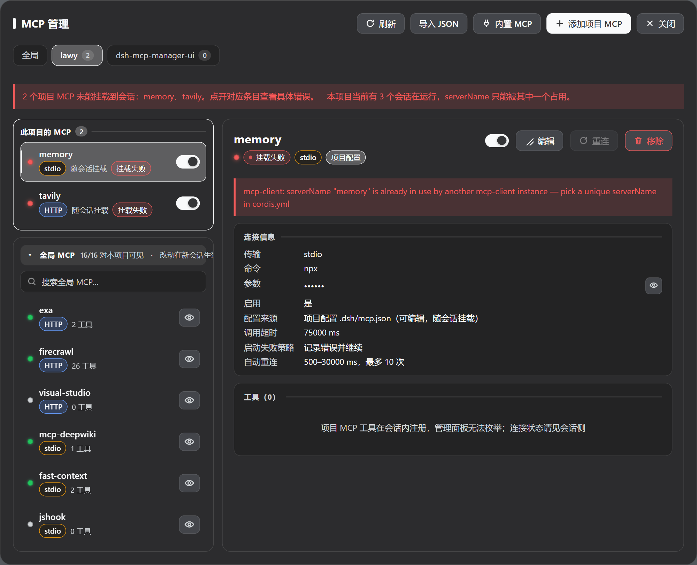
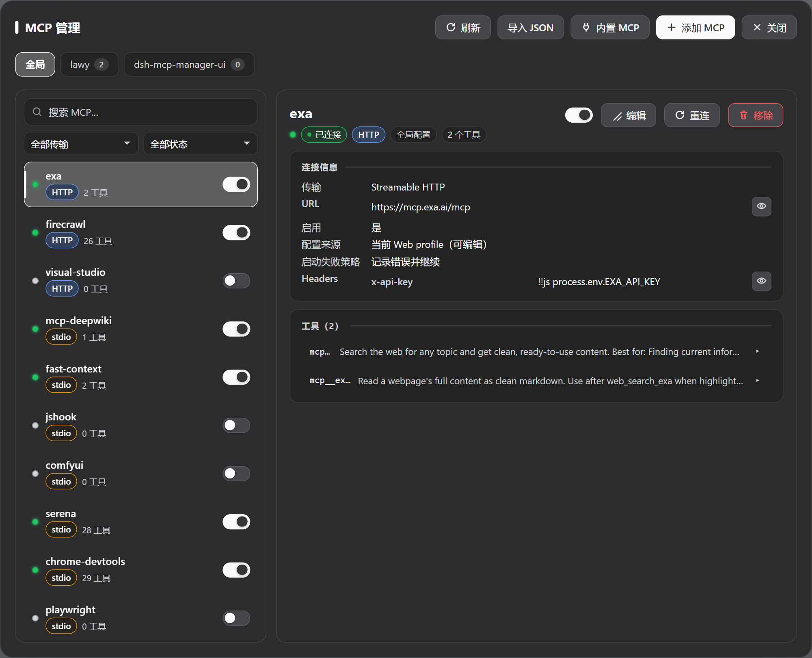
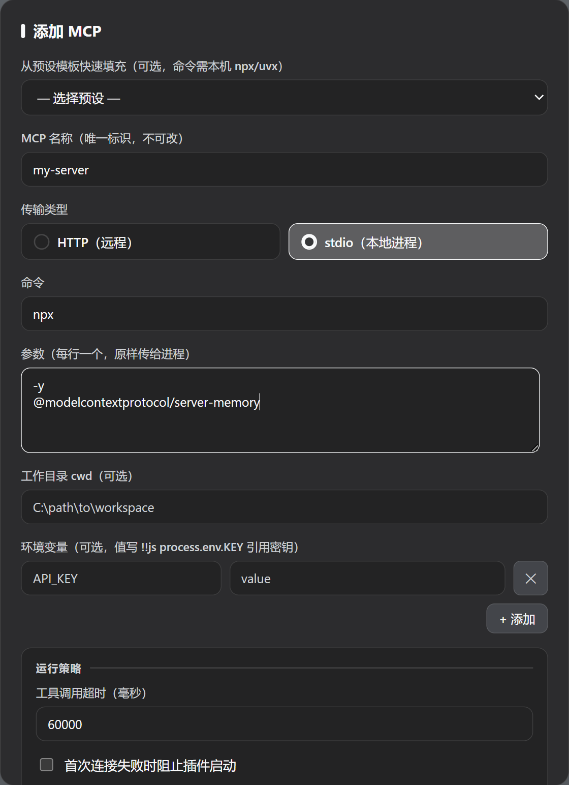

# dsh-mcp-manager-ui

中文 | [English](README.en.md)

<p align="center">
  <a href="https://linux.do/" title="LINUX DO"></a>
</p>

<p align="center">
  <a href="https://github.com/Imzl-zl/dsh-mcp-manager-ui/actions/workflows/ci.yml"></a>
  <a href="https://www.npmjs.com/package/dsh-mcp-manager-ui"></a>
  <a href="https://www.npmjs.com/package/dsh-mcp-manager-ui"></a>
  <a href="./LICENSE"></a>
  
</p>

DeepSeek Harness Web 的 **MCP 管理面板**：右下角悬浮按钮或侧栏「MCP」入口，点开就能看连接状态、加服务器、改配置——面板浮在会话之上，**不打断正在进行的对话**。

## 界面预览

### 全局管理面板



### 项目作用域（`.dsh/mcp.json`）



### 连接详情与新增





## 功能

- 查看每个 MCP 的状态、传输方式、连接参数与工具列表；展开工具可看完整输入 JSON Schema（必填/可选、类型、枚举、默认值与原始 JSON）
- 按传输方式（HTTP/stdio）与状态筛选，按名称/命令/URL 搜索
- 启用、禁用、重连、添加、编辑、移除；需要时用眼睛临时揭示被掩码的凭据并一键复制
- **全局 + 项目双作用域**：全局写 Web profile，一次注册所有项目可用；项目写该项目 `.dsh/mcp.json`，只该项目会话可见；项目里还能「屏蔽」某个全局 MCP
- **两个入口，同一个面板**：右下角悬浮按钮（可拖拽、记忆位置）与官方侧栏入口（展开态在「设置」上方显示「MCP」，收起成 56px 轨道时只剩图标）共享同一开关状态
- 从「内置 MCP」目录一键安装 Exa、Tavily、Firecrawl、Chrome DevTools、Playwright（已配置的只识别并跳过，不覆盖）
- 导入 Claude、Cursor、Cline、Roo 的 `mcpServers` 与 VS Code 的 `servers` JSON，写入前预览，支持「合并（同名更新）」与「替换」
- 跟随 DSH 深色/浅色主题，适配窄屏与移动宽度
- 非强制更新提示：有新版时在面板顶部显示可关闭的提示条，每天最多查一次、绝不自动更新，可用 `DSH_MCP_MANAGER_DISABLE_UPDATE_CHECK` 关闭

## 安装

```sh
# 推荐：npm 安装 —— 之后 `dsh plugin update` 会在 ^1.x 内自动升到最新小版本
dsh plugin --profile web add dsh-mcp-manager-ui@^1.2.1

# 或固定 GitHub release tag（不会自动跨版本，升级要换 tag 重新 add）
dsh plugin --profile web add github:Imzl-zl/dsh-mcp-manager-ui#v1.2.1
```

装完**重启 `dsh web`**。升级：

```sh
dsh plugin --profile web update dsh-mcp-manager-ui
```

卸载（不会删除 profile 里已有的 MCP 条目）：

```sh
dsh plugin --profile web remove dsh-mcp-manager-ui
```

细节、本地开发安装与故障排查见 [安装与升级](docs/installation.md)。

> 不要把 `mcp-manager-ui` 手工插进 profile 的 `cordis.patch.yml`、Agent preset 或额外的 `--patch` 文件——插件命令已经完成这件事，重复装配会明确报错。

## 使用

### 打开面板

两个入口，同一个面板：

- **右下角悬浮按钮**：可拖拽移动，位置会被记住；
- **侧栏底部「MCP」**：展开态在「设置」上方，侧栏收起成 56px 轨道时只剩图标。

面板浮在会话之上，关掉它（右上角「关闭」或 Esc）不会影响会话。

两个入口都能单独关掉：面板右上角「入口」里选 `悬浮按钮 + 侧栏入口`（默认）/ `仅悬浮按钮` / `仅侧栏入口`。**不能两个都关**——面板只能从这两个入口打开，所以这是一个三选一，而不是两个独立的开关。选择存在浏览器本地（localStorage），换浏览器或清缓存要重选一次。

### 全局 vs 项目

顶部标签页在「全局」与各项目之间切换：

| 标签页 | 存哪 | 谁可见 | 改动何时生效 |
|---|---|---|---|
| 全局 | Web profile 的 `cordis.patch.yml` | 所有项目 | DSH 热加载，通常立即生效 |
| 某项目 | 该项目 `.dsh/mcp.json` | 只该项目会话 | 下一次新建的连接（见下） |

`serverName` 按作用域判重：不同项目之间、全局与项目之间**可以同名**，各自独立连接；同一作用域内不能重名。

### 常用操作

在列表行或详情页里：

- **开关**：启用 / 禁用（全局写 profile 补丁的 `disabled`，项目写 `.dsh/mcp.json`）；
- **重连**：仅全局可用（项目连接由会话持有，重连由 `mcp-client` 自己管）；
- **编辑 / 移除**：移除只影响当前作用域；
- **屏蔽**（项目页里对全局 MCP）：写 `exclude`，该项目的新会话不再看到它——全局实例仍在跑，所以不影响其他项目。

### 添加 MCP

三条路，都从面板顶部工具栏进：

1. **添加 MCP**：表单填 `command`/`args`/`env`/`cwd`（stdio）或 `url`/`headers`（HTTP），可设调用超时、启动失败策略与重连策略；常用服务器有预设模板可一键套用。
2. **导入 JSON**：粘贴其他客户端的配置，先预览再写入。支持「合并（同名更新）」与「替换」，字段映射与限制见 [JSON 导入](docs/json-import.md)。
3. **内置 MCP**：勾选未配置的项一次装好（Exa、Tavily、Firecrawl、Chrome DevTools、Playwright）。前三项有免密额度、不需要本地依赖；后两项是本地工具，需要 Node.js 与浏览器。已配置的项只识别并跳过，不会覆盖。

### 看工具与敏感值

详情页列出该 MCP 当前注册的工具；展开可看完整输入 Schema。凭据类字段默认掩码，点眼睛图标会向 Host 读取**有效运行值**（已解析过的环境变量）并临时显示，再点一次恢复；已显示的值可一键复制。编辑时若没实际改动输入，保存仍保留原来的引用写法，不会把密钥写回配置文件。

## 配置生效时机（重要）

| 作用域 | 修改后何时生效 |
|---|---|
| 全局 | DSH 热加载，通常立即生效（含运行中的会话） |
| 项目 | **下一次新建的连接**生效；正在运行的会话不受影响 |

项目 MCP 在会话创建/恢复时按当时的 `.dsh/mcp.json` 装配，会话进行中不重读配置——**会话里改配置不生效是预期行为**（Claude Code、Codex 等客户端的项目级 MCP 同样要求新开会话）；「屏蔽」同理，只对之后的会话生效。改完不需要点「重连」，也不需要重启 Host。

> **共享连接下的边界**：项目 MCP 是「该项目所有会话共用一份连接」的模型，连接由**最先打开该项目会话时**的配置建立。所以「新开一个会话」并不总等于「用上新配置」：该项目**已经没有会话**在跑 → 新会话立刻用新配置；该项目**还有会话**在跑 → 新会话复用现有连接、沿用旧配置，此时面板会在该项目行标出 `配置待生效`，等所有会话结束后下一个会话才用新配置建连。面板只是如实告知，不会在运行中把连接从正在对话的会话脚下换掉。

## 常见问题

**面板里显示「已禁用」，但模型调用报 `unknown tool "mcp__xxx__..."`**
那个 MCP 被禁用了，所以它没有注册任何工具。在面板里点「启用」即可（全局会写 profile 补丁并热加载，项目写 `.dsh/mcp.json`、新会话生效）。

**那一行显示「挂载失败」「连接失败」或「作用域隔离失败」，怎么区分？**
三类是不同的事，详情页会给出具体原因：**挂载失败** = 会话 setup 阶段就没挂上（变量求值为空、`failOnStartupError` 下启动失败、工具注册被拒）；**连接失败** = `mcp-client` 连不上或重连耗尽（原因取自它的日志）；**作用域隔离失败** = 连接正常但工具不在共享作用域层（宿主里出现了两份 `@deepseek-ai/dsh-scope`）。排查与原理见 [设计与限制](docs/design.md#连接状态语义)。

**项目行显示「待会话挂载」/「配置待生效」/「N 个会话共用」**
分别是：该项目还没有会话持有这份共享连接 / 配置改过但仍在复用旧连接（见上一节）/ 当前有几个会话在共用它。

**怎么升级？为什么面板没提示？**
从 npm 装的直接 `dsh plugin --profile web update dsh-mcp-manager-ui` 就会升小版本，不需要等提示。面板的提示条只查 GitHub Releases、每天最多一次、可关闭、绝不自动更新；固定 tag 安装的用户不会自动跨版本，需要用新 tag 重新 `add`（见 [安装与升级](docs/installation.md)）。

**改动会不会碰到我的其他配置？**
不会。全局改动只动 profile 补丁里由 `@deepseek-ai/dsh-mcp-client` 声明、且由本插件管理的条目，保留其他插件条目、注释与 `!!js` 表达式；导入「替换」也只替换这一部分，不会删除其他 bundle 或 Agent preset 自带的 MCP。

**卸载后我配置的 MCP 会消失吗？**
卸载插件不会删除 profile 里已有的 `@deepseek-ai/dsh-mcp-client` 条目；项目的 `.dsh/mcp.json` 也留在原处（它本来就是普通 JSON 文件）。

## 兼容性

| 项目 | 已验证 |
|---|---|
| DeepSeek Harness | `0.1.5-rc.1` 及以上（已验证至 `0.1.5-rc.2`） |
| Node.js | DSH 自带/支持的运行时 |
| 平台 | Windows；Linux/macOS 使用同一 DSH Web 契约 |

只支持 0.1.5 起（更早的版本缺少「按注册作用域判 `serverName` 唯一性」与「setup 传入 agent」两个能力），不为旧版本保留降级分支。原因与依赖细节见 [设计与限制](docs/design.md#兼容性与依赖细节)。

## 开发

```sh
npm test                              # 全部测试（含真机集成用例）
dsh --profile web --dump-config       # 看 profile 的有效配置
dsh web                               # 起 Web 做真实操作验证
```

`npm test` 里除替身用例（验证插件内部自洽）外，还有一组**真机集成用例**：真 `cordis` + 真 `dsh-tools` + 真 `dsh-scope` + 真 `dsh-mcp-client` + 一个真 stdio MCP 子进程，覆盖「同项目两个会话共用一份连接、工具投射进会话层、不泄漏到全局、子进程随最后一个会话退出」。CI（push 到 main / PR，以及推 tag 发版）跑的是同一条门槛，发版流程见 [安装与升级](docs/installation.md#发布流程维护者)。

## 文档

- [安装与升级](docs/installation.md)
- [JSON 导入](docs/json-import.md)
- [设计与限制](docs/design.md)（共享连接模型、连接状态语义、已知限制、依赖细节）
- [DeepSeek Harness 官方插件发布指南](https://github.com/deepseek-ai/deepseek-harness/blob/master/docs/user/develop/basic/publish.md)

## 相关链接

- [LINUX DO](https://linux.do/)（友链）
- [DeepSeek Harness](https://github.com/deepseek-ai/deepseek-harness)
- [GitHub `dsh-plugin` 主题](https://github.com/topics/dsh-plugin)

## License

MIT
